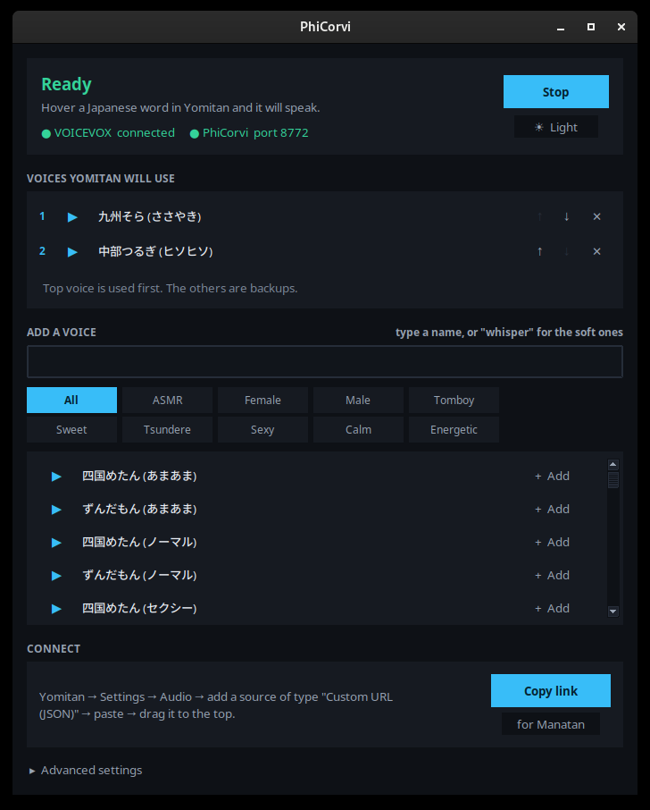
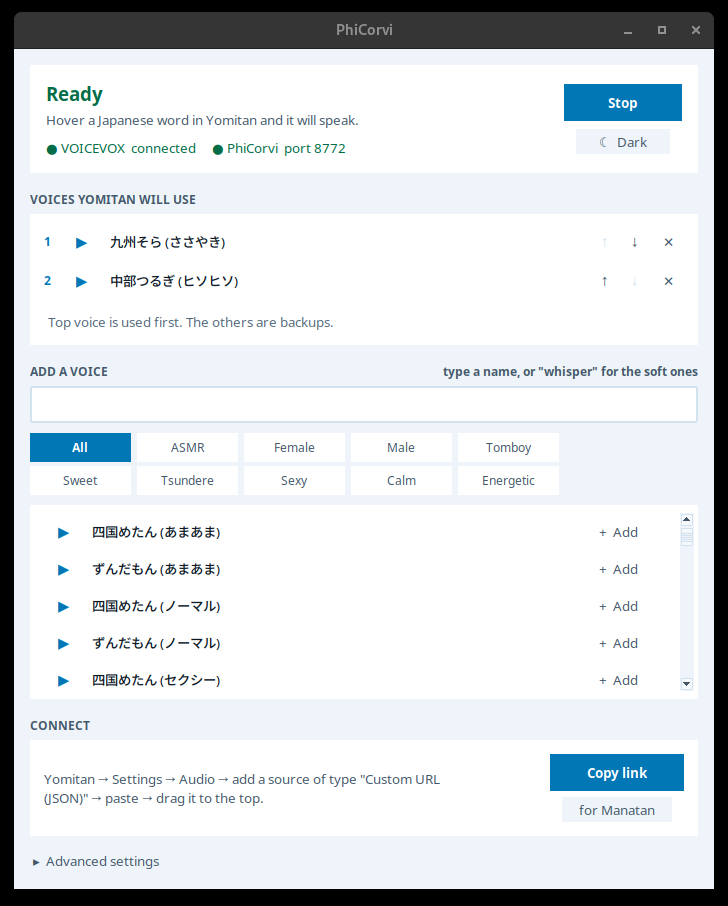

# PhiCorvi

Give Yomitan a local Japanese voice. Every word gets audio — including the rare ones
JapanesePod101 and Forvo have never heard of — and it lands in your Anki cards
automatically.

<p align="center">
  
  
</p>

PhiCorvi connects [VOICEVOX](https://voicevox.hiroshiba.jp/) (a free Japanese speech
engine that runs on your own machine) to [Yomitan](https://yomitan.wiki/), which can't
talk to it directly. Point Yomitan at PhiCorvi and it just works.

- ~99 voices, including several whisper styles that don't get tiring after 300 lookups
- Works offline, no rate limits, no missing entries
- Mined Anki cards stop having silent audio fields
- One window: start, stop, pick voices, preview, copy the URL
- Reads whole sentences and paragraphs too, not just single words
- Optional clipboard watch: copy a line from a novel and hear it, no window switching

*Named after φ Corvi, a star in Corvus — the crow. Crows imitate human speech, which is
more or less the job.*

---

## Download

**Windows:** grab `PhiCorvi.exe` from the
[latest release](https://github.com/XnoahR/PhiCorvi/releases/latest). Nothing to
install — double-click it. Python is bundled inside.

Windows will likely say *"Windows protected your PC"* the first time. That's what it
says about any new app without a paid code-signing certificate. Click **More info** →
**Run anyway**, or read the source here first — it's all in `phicorvi.py`.

**macOS / Linux:** run from source, `python3 phicorvi.py`. Needs Python 3 and nothing
else — the app only uses the standard library.

---

## Quick start

**1. Install and open [VOICEVOX](https://voicevox.hiroshiba.jp/).** Leave it running —
it's the part that actually speaks.

**2. Open PhiCorvi.** It starts the bridge itself, and the Status panel tells you
whether it can see VOICEVOX.

**3. Click **Copy** next to "Yomitan"** in the Connect panel.

**4. In Yomitan**: Settings → Audio → Configure audio playback sources → add a source
of type **Custom URL (JSON)** → paste → drag it to the **top** of the list.

Hover a Japanese word. It should speak.

For Anki, put `{audio}` in your audio field under Settings → Anki. Nothing else to
configure.

---

## The app

| | |
|---|---|
| **Start / Stop** | Runs the bridge. Remembers its state and restores it next launch. |
| **Voices** | Filter by group (ASMR, Female, Male, Tomboy, Sweet, Tsundere, Sexy, Calm, Energetic) or search by name. Add as many as you like and set their order. |
| **Preview** | Every row has its own ▶ button, so you always hear the voice you clicked. |
| **Copy** | Ready-to-paste URLs for Yomitan and Manatan. |
| **Speak any text** | Paste a sentence or a whole paragraph, hear it, and save it as a file. |
| **Read what I copy** | Tick it, then just select a sentence and press Ctrl+C while you read. Japanese text is spoken; URLs, code and anything too long are ignored. |
| **Settings** | Three tabs beside Home. **Reading**: port, speed, intonation, and which engine reads the sentence. **Scene tone**: the model that marks sentences up with emotion. Lower intonation = flatter, calmer. |
| **Theme** | Light and dark, both blue. |

Settings save to `phicorvi_config.json` beside the script.

### Whisper voices

Easiest on the ears when you're looking up hundreds of words a night:

| ID | Voice |
|----|-------|
| 19 | 九州そら (ささやき) |
| 22 | ずんだもん (ささやき) |
| 36 | 四国めたん (ささやき) |
| 37 | 四国めたん (ヒソヒソ) |
| 38 | ずんだもん (ヒソヒソ) |
| 71 | 満別花丸 (ささやき) |
| 96 | 中部つるぎ (ヒソヒソ) |

IDs come from your engine — the app lists whatever yours has.

---

## No-GUI version

`phicorvi_cli.py` is the same bridge without the window, for a server or if you prefer
a terminal:

```
python3 phicorvi_cli.py                     # defaults
SPEAKERS=19,96 python3 phicorvi_cli.py      # pick voices
python3 phicorvi_cli.py --list              # show every voice id
```

Configured entirely by environment variables: `SPEAKERS`, `PORT`, `SPEED_SCALE`,
`INTONATION_SCALE`, `VOICEVOX_URL`.

---

## Running VOICEVOX in Docker

If you'd rather not install the app:

```
docker run -d --name voicevox --restart unless-stopped \
  -p 127.0.0.1:50021:50021 \
  voicevox/voicevox_engine:cpu-ubuntu20.04-latest
```

`--restart unless-stopped` matters. Without it the container dies whenever the Docker
daemon restarts — which snap-packaged Docker does on auto-update — and your audio stops
with no visible reason.

---

## Troubleshooting

Check in this order. It's almost always the first one.

**No sound.** Is PhiCorvi still open? Is VOICEVOX still open? Both have to be running.

**Still no sound.** Paste the Yomitan URL into your browser's address bar. If the
browser can't load it, Yomitan can't either — that separates "the bridge is broken"
from "Yomitan is misconfigured" in one step.

**`ERR_UNSAFE_PORT` in the browser.** You changed the port to one Chromium refuses to
open. **5060 and 5061 are blocked** (they're SIP). Use 8772, or anything not on
[Chromium's blocked port list](https://chromium.googlesource.com/chromium/src/+/refs/heads/main/net/base/port_util.cc).
PhiCorvi warns you before starting on a known-bad port.

**Port already in use.** Other Japanese-mining tools commonly hold `5050`
(local-audio-yomichan), `8765` (AnkiConnect) and `8770` (Forvo server). Pick another.

**Audio works for some words but not others.** Yomitan plays the *first* source that
returns audio. If VOICEVOX isn't at the top of the list, the sources above it win
whenever they have the word.

**Nothing happens at all, no errors.** Yomitan's audio sources are **per-profile**.
Adding the source to one profile does nothing in the others — switch to the profile
you actually read with and add it there too.

---

## A note on pitch accent

Synthesized speech approximates pitch accent; it doesn't reproduce it reliably. If
you're studying accent seriously, keep a real-recording source (NHK, Forvo,
JapanesePod101) **above** PhiCorvi. Yomitan then uses the human recording whenever one
exists and falls back to PhiCorvi only for words nothing else covers — which still
kills the silent-audio-field problem without trading away accuracy.

Put PhiCorvi first only if you want one consistent voice everywhere.

---

## Anki: sentence audio on your mined cards

Mining a word from a novel gives you the sentence as text and nothing to listen
to -- there is no recording of a novel line the way there is for an anime
subtitle. The add-on in [`anki-addon/`](anki-addon) fills that field by asking
PhiCorvi to read the sentence.

**Install** -- grab `PhiCorviSentenceAudio.ankiaddon` from the
[latest release](../../releases/latest), double-click it, restart Anki.

**Use it** -- keep PhiCorvi open while you mine. New cards fill themselves a
couple of seconds after Yomitan adds them. For cards you already have:
**Tools -> PhiCorvi: isi audio kalimat kosong...**, or select some in Browse and
use the **Notes** menu.

Out of the box it knows Kiku, Lapis, Lapis (Jiten) and JP Mining Note. For any
other note type, add its name and field names under `targets` in the add-on's
config.

Audio comes back as mp3 rather than wav, which matters more than it sounds: a
sentence is around 60 KB as mp3 against 700 KB as wav, and Anki syncs every byte
of it. The conversion happens in PhiCorvi because Anki's Flatpak sandbox has no
ffmpeg of its own.

Notes it fills get a `phicorvi-tts` tag, so synthesized audio stays
distinguishable from real recordings.

## A different reading engine

VOICEVOX is the default and stays the default. Its readings come from a
dictionary, so a rare word is spoken correctly rather than guessed at -- which
matters more in a vocabulary tool than the voice does.

**Irodori-TTS** is the alternative: a neural engine that reads the sentence and
copies a voice from one recording at the same time. Give it a clip of somebody
talking and it will read your mined sentences in that voice, with no training
step and nothing to convert afterwards.

The **Reading** tab is where it lives:

```
Engine           [ Irodori ▾ ]
Irodori address  [ http://127.0.0.1:8088 ]  [Find]
Server           [ …/irodori/serve.sh ]     [Start]
                 [Download engine]
Reference voice  [ waguri ▾ ]               [Add…]
```

**Download engine** fetches the whole thing into the PhiCorvi add-on folder --
uv, the server source, the model weights, and a launcher -- and points *Server*
at it. It needs neither Python nor git on the machine: uv brings its own. Expect
about 11 GB with an NVIDIA card, or 4 GB CPU-only, and it can be stopped and
resumed. The dialog says the size and the destination before anything downloads.

**Start** runs the server as a child process, so it shuts down with the app.
Loading the model takes about half a minute, and the note counts the seconds and
shows what the server itself is saying while it does.

### Voices

A voice is one folder of recordings:

```
<add-on>/user_files/irodori/voice_model/
    bocchi/     bocchi.mp3
    nijika/     nijika.mp3
    waguri/     1-waguri2.mp3
```

The folder name is the voice name. Add a character by making a folder and
dropping a recording in -- nothing to restart. **Add…** does the same through a
file picker.

Only the **first 8 seconds** are used, and where several files sit in one folder
they are joined in filename order, so the first file decides the voice. Ten
seconds of clean, single-speaker speech is enough; music, echo, and clips of
reaction noises rather than speech all get copied into every sentence you
generate.

Two behaviours are deliberate:

- **If Irodori fails and VOICEVOX is running, the sentence comes back in the
  VOICEVOX voice** rather than not at all. That fallback is never cached, so
  fixing the server is heard immediately instead of after the cache turns over.
  The reply carries `X-Engine`, so you can tell which one actually spoke.
- **Everything that changes the sound is part of the cache key** -- engine,
  voice, speed, intonation, and the emoji markup below. Change any of them and
  the next sentence is synthesised again rather than served from before.

## Scene tone

Off by default. Turned on, a language model reads each mined sentence and marks
it up with the emoji Irodori understands as delivery instructions -- a chuckle
here, a gasp there -- so a line sounds like the scene it came from instead of
being read flat.

The **Scene tone** tab takes an API key of your own, a model name, and the
address of any OpenAI-compatible endpoint.

**Your sentence is never reworded.** The reply is only used when removing the
emoji gives back your sentence character for character; a model that
paraphrases, drops a clause, or "corrects" a rare kanji fails that check and is
discarded. That matters in a vocabulary tool, where a card that reads back
something other than what you mined is worse than a card read flatly.

Three things worth knowing:

- **It only runs on whole sentences.** Yomitan word lookups skip it entirely --
  a single word has no scene to have a tone.
- **It costs one call per new sentence**, and the answer is kept, so replaying a
  card is free. On a free provider the call is usually the slowest part of the
  chain, and its latency varies more than the synthesis does.
- **Every failure is silent and harmless.** No key, no answer, a bad reply, or
  VOICEVOX as the engine, and the sentence is simply read plainly.

## Manatan

Manatan works too, with two differences.

Use `localtest.me` instead of `localhost` — Manatan fetches audio through its own
server, and that proxy rejects loopback addresses with `403 Forbidden audio host`.
`localtest.me` is a public DNS name that resolves to `127.0.0.1`, so it passes the check
and still reaches your machine. The app's "Manatan" Copy button gives you the right URL.

Manatan's source order is hardcoded — JapanesePod101, LanguagePod101, Jisho, TTS, then
custom — and can't be reordered, so on Auto it never reaches PhiCorvi. You can
right-click the speaker button and pick Custom URL per word, but the choice resets on
the next lookup. For automatic playback, use Yomitan.

---

## Setup guides

- **[Panduan Bahasa Indonesia](docs/PANDUAN-id.md)** — panduan lengkap pakai aplikasi,
  ditulis untuk yang belum terbiasa hal teknis
- [English](docs/SETUP.md) — manual setup without the app
- [Bahasa Indonesia (manual)](docs/SETUP-id.md) — cara manual tanpa aplikasi

Reading sentences in a voice of your own:

- [Irodori guide](docs/IRODORI.md) — what the recording has to be, and why that is
  the part that decides whether it works
- [Panduan Irodori](docs/IRODORI-id.md) — versi Bahasa Indonesia

---

## Update checks

Both the app and the add-on ask GitHub once whether a newer release exists --
the app at startup, the add-on once a day -- and say nothing unless there is
one. Nothing else is sent: no identifier, no usage, no collection contents.

The question goes to `/releases/latest`, which answers with a redirect, rather
than to GitHub's API: the API allows 60 unauthenticated calls an hour counted
per IP address, so on a shared address the budget is often already spent by
strangers.

To switch it off, set `check_updates` to `false` -- in `phicorvi_config.json`
for the app, or in the add-on's config for the add-on.

## Licence

MIT. VOICEVOX itself has its own terms — each voice has its own rules about
[how generated audio may be used](https://voicevox.hiroshiba.jp/term/), and most
require crediting the character if you publish the audio. Personal study and Anki cards
are fine.
